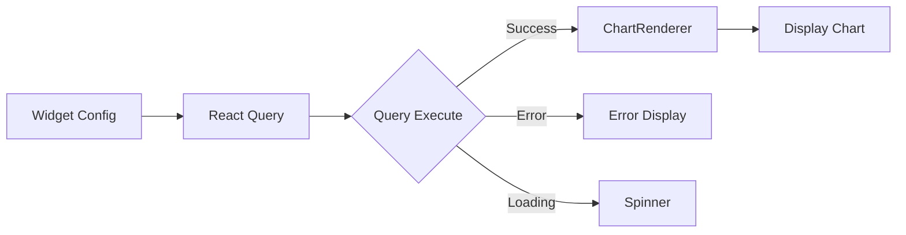

# Dashboard Components

Interactive dashboard system with drag-and-drop widgets, real-time data updates, and persistent layouts.

## Overview

The dashboard system allows users to create custom dashboards with resizable, draggable widgets displaying query results and visualizations. Features include:

- Drag-and-drop layout editing
- Auto-save positions
- Real-time data refresh
- Multiple visualization types
- Export capabilities
- Widget management (add, remove, configure)

---

## DashboardGrid

Main grid layout component using react-grid-layout for interactive widget positioning.

### Props

No props required. Uses Zustand store for state management.

### Usage Example

```tsx
import { DashboardGrid } from '@/components/dashboard/DashboardGrid';

function DashboardPage() {
  return (
    <div className="p-6">
      <DashboardGrid />
    </div>
  );
}
```

### Features

**Drag-and-Drop**
- Drag widgets by header handle
- Resize from corners/edges
- Snap to grid (12 columns)
- Compact vertical layout

**Responsive**
- Container width automatically measured
- Grid adapts to available space
- Mobile-friendly (stacked layout)

**Edit Mode**
- Toggle edit/view mode
- Dragging only enabled in edit mode
- Resize handles visible in edit mode

**Auto-save**
- Widget positions saved on change
- Persisted to backend via API
- Optimistic UI updates

**Empty State**
- Helpful message when no widgets
- Prompts user to add widgets

### Grid Configuration

```typescript
const gridConfig = {
  cols: 12,              // 12-column grid
  rowHeight: 80,         // 80px per row
  margin: [16, 16],      // 16px spacing
  compactType: 'vertical', // Auto-compact upward
  preventCollision: false, // Allow overlapping during drag
};
```

### Layout Structure

```typescript
interface Layout {
  i: string;    // Widget ID
  x: number;    // Column position (0-11)
  y: number;    // Row position
  w: number;    // Width in columns (1-12)
  h: number;    // Height in rows
  minW: number; // Minimum width
  minH: number; // Minimum height
  maxW: number; // Maximum width
  static: boolean; // Is draggable/resizable
}
```

### State Management

Uses `useDashboardStore()`:

```typescript
const {
  widgets,              // Widget[]
  isEditing,           // boolean
  updateWidgetPosition, // (id, position) => void
  currentDashboard,    // Dashboard | null
} = useDashboardStore();
```

### Accessibility
- Keyboard navigation in view mode
- Focus management during drag
- ARIA labels for drag handles

### Notes
- **Performance**: Debounced position updates prevent excessive API calls
- **Collision**: Widgets can overlap during drag, then auto-compact
- **Grid System**: 12-column responsive grid like Bootstrap

---

## DashboardWidget

Individual widget component that displays data and provides interaction controls.

### Props

| Prop | Type | Description |
|------|------|-------------|
| `widget` | `DashboardWidget` | Widget configuration and data |

### Widget Interface

```typescript
interface DashboardWidget {
  id: string;
  dashboard_id: string;
  title: string;
  widget_type: 'chart' | 'table' | 'kpi' | 'metric';
  query: string;
  position: {
    x: number;
    y: number;
    w: number;
    h: number;
  };
  chart_config?: {
    type?: ChartType;
    xKey?: string;
    yKeys?: string[];
    colors?: string[];
  };
  refresh_interval?: number; // Seconds
  created_at: string;
  updated_at: string;
}
```

### Usage Example

```tsx
import { DashboardWidgetComponent } from '@/components/dashboard/DashboardWidget';

const widget = {
  id: 'widget-1',
  dashboard_id: 'dash-1',
  title: 'Monthly Revenue',
  widget_type: 'chart',
  query: 'SELECT month, revenue FROM sales',
  position: { x: 0, y: 0, w: 6, h: 4 },
  chart_config: {
    type: 'bar',
    xKey: 'month',
    yKeys: ['revenue'],
  },
  refresh_interval: 60,
};

<DashboardWidgetComponent widget={widget} />
```

### Features

**Data Fetching**
- Automatic query execution via React Query
- Configurable refresh intervals
- Loading states
- Error handling with retry

**Drag Handle** (Edit Mode Only)
- Visible at top of widget
- Gripper icon indicates draggable area
- Only shown in edit mode

**Action Menu**
- Refresh button
- Settings button (future)
- Delete button

**Auto-refresh**
- Configurable interval (e.g., 60 seconds)
- Visual indicator at bottom
- Pauses when tab inactive

**Delete Confirmation**
- Modal dialog before deletion
- Prevents accidental removal
- Accessible keyboard controls

### Data Flow



### Query Execution

```tsx
const { data, isLoading, error, refetch } = useQuery({
  queryKey: ['widget-data', widget.id, widget.query],
  queryFn: async () => {
    const response = await api.post('/queries/execute', {
      query: widget.query,
    });
    return response;
  },
  refetchInterval: widget.refresh_interval ? widget.refresh_interval * 1000 : false,
  staleTime: 30000,
  retry: 1,
});
```

### Chart Type Mapping

```typescript
function widgetTypeToChartType(widgetType: string): ChartType {
  const mapping = {
    'chart': 'bar',
    'table': 'table',
    'kpi': 'kpi',
    'metric': 'kpi',
  };
  return mapping[widgetType] || 'table';
}
```

### Edit Mode Controls

In edit mode, widgets display:
- Drag handle at top
- Settings icon (top-right)
- Delete icon (top-right)

```tsx
{isEditing && (
  <>
    <div className="drag-handle">
      <GripHorizontal className="h-4 w-4" />
    </div>
    <div className="controls">
      <Button size="icon"><Settings /></Button>
      <Button size="icon" onClick={handleDelete}><Trash2 /></Button>
    </div>
  </>
)}
```

### Refresh Indicator

Shows refresh interval at bottom when configured:

```tsx
{widget.refresh_interval && (
  <div className="text-xs text-muted-foreground">
    Auto-refresh: {widget.refresh_interval}s
  </div>
)}
```

### Error States

Three main states handled:
1. **Loading**: Spinner with message
2. **Error**: Error message with retry button
3. **No Data**: Empty state message

```tsx
if (isLoading) return <LoadingSpinner />;
if (error) return <ErrorDisplay error={error} onRetry={refetch} />;
if (!data?.data) return <NoDataMessage />;
return <ChartRenderer data={data.data} config={chartConfig} />;
```

### Accessibility
- Proper heading hierarchy
- ARIA labels for controls
- Keyboard accessible delete confirmation
- Focus management in dialogs

### Notes
- **Query Caching**: React Query caches results by widget ID and query
- **Stale Time**: Data considered fresh for 30 seconds
- **Refetch Interval**: Only when `refresh_interval` is set
- **Retry Logic**: Single retry on failure, then show error

---

## ShareDashboardDialog

Modal dialog for sharing dashboards via link or export.

### Props

| Prop | Type | Description |
|------|------|-------------|
| `dashboardId` | `string` | Dashboard to share |
| `isOpen` | `boolean` | Dialog open state |
| `onClose` | `() => void` | Close callback |

### Usage Example

```tsx
import { ShareDashboardDialog } from '@/components/dashboard/ShareDashboardDialog';

function DashboardHeader() {
  const [isOpen, setIsOpen] = useState(false);

  return (
    <>
      <Button onClick={() => setIsOpen(true)}>Share</Button>
      <ShareDashboardDialog
        dashboardId={currentDashboard.id}
        isOpen={isOpen}
        onClose={() => setIsOpen(false)}
      />
    </>
  );
}
```

### Features

**Share Link**
- Generate public link
- Copy to clipboard
- Expiration options

**Export Options**
- JSON export (dashboard config)
- PDF export (visual snapshot)
- Share via email

**Permissions**
- View-only links
- Edit access (authenticated users)
- Time-limited access

### Notes
- Uses Radix UI Dialog
- Accessible keyboard navigation
- Proper focus trapping

---

## Dashboard Store

The dashboard system uses Zustand for state management:

```typescript
interface DashboardStore {
  // State
  dashboards: Dashboard[];
  currentDashboard: Dashboard | null;
  widgets: DashboardWidget[];
  isEditing: boolean;

  // Actions
  setCurrentDashboard: (id: string) => void;
  addWidget: (widget: Partial<DashboardWidget>) => void;
  removeWidget: (id: string) => void;
  updateWidgetPosition: (id: string, position: Position) => void;
  setEditing: (editing: boolean) => void;
  fetchDashboards: () => Promise<void>;
  fetchWidgets: (dashboardId: string) => Promise<void>;
  createDashboard: (name: string) => Promise<Dashboard>;
  deleteDashboard: (id: string) => Promise<void>;
}
```

### Store Usage

```tsx
import { useDashboardStore } from '@/stores/dashboardStore';

function MyComponent() {
  const {
    currentDashboard,
    widgets,
    isEditing,
    setEditing,
    addWidget,
  } = useDashboardStore();

  return (
    <div>
      <button onClick={() => setEditing(!isEditing)}>
        {isEditing ? 'Done Editing' : 'Edit'}
      </button>
      <DashboardGrid />
    </div>
  );
}
```

---

## API Integration

### Dashboard Endpoints

```typescript
// Get all dashboards
GET /api/dashboards
Response: {
  dashboards: Dashboard[],
  total: number
}

// Create dashboard
POST /api/dashboards
Body: { name: string, description?: string }
Response: Dashboard

// Get dashboard widgets
GET /api/dashboards/:id/widgets
Response: {
  widgets: DashboardWidget[],
  total: number
}

// Add widget
POST /api/dashboards/:id/widgets
Body: {
  title: string,
  widget_type: string,
  query: string,
  position: Position,
  chart_config?: ChartConfig
}
Response: DashboardWidget

// Update widget position
PATCH /api/dashboards/:dashboardId/widgets/:widgetId
Body: { position: Position }
Response: DashboardWidget

// Delete widget
DELETE /api/dashboards/:dashboardId/widgets/:widgetId
Response: { success: boolean }
```

### Query Client Setup

```tsx
import { QueryClient, QueryClientProvider } from '@tanstack/react-query';

const queryClient = new QueryClient({
  defaultOptions: {
    queries: {
      staleTime: 30000,
      retry: 1,
    },
  },
});

<QueryClientProvider client={queryClient}>
  <App />
</QueryClientProvider>
```

---

## Pinning Query Results

Users can pin query results from the chat interface to dashboards:

```tsx
import { PinToDashboardDialog } from '@/components/dialogs/PinToDashboardDialog';

function QueryResult({ data, query }) {
  const [showPinDialog, setShowPinDialog] = useState(false);

  return (
    <>
      <Button onClick={() => setShowPinDialog(true)}>
        <Pin className="mr-2" />
        Pin to Dashboard
      </Button>

      <PinToDashboardDialog
        isOpen={showPinDialog}
        onClose={() => setShowPinDialog(false)}
        query={query}
        data={data}
      />
    </>
  );
}
```

### Pin Dialog Features
- Select target dashboard
- Configure widget title
- Choose visualization type
- Set refresh interval
- Position automatically assigned

---

## Layout Persistence

Widget positions are automatically saved:

```typescript
const handleLayoutChange = useCallback(
  (newLayout: Layout[]) => {
    if (!isEditing) return;

    newLayout.forEach((item) => {
      const widget = widgets.find((w) => String(w.id) === item.i);
      if (widget) {
        const positionChanged =
          widget.position.x !== item.x ||
          widget.position.y !== item.y ||
          widget.position.w !== item.w ||
          widget.position.h !== item.h;

        if (positionChanged) {
          updateWidgetPosition(widget.id, {
            x: item.x,
            y: item.y,
            w: item.w,
            h: item.h,
          });
        }
      }
    });
  },
  [widgets, isEditing, updateWidgetPosition]
);
```

### Optimistic Updates

Position updates use optimistic UI:

```tsx
const updateWidgetPosition = async (id: string, position: Position) => {
  // Update local state immediately
  setWidgets(prev => prev.map(w =>
    w.id === id ? { ...w, position } : w
  ));

  // Sync with backend
  try {
    await api.patch(`/dashboards/${dashboardId}/widgets/${id}`, {
      position
    });
  } catch (error) {
    // Revert on error
    await fetchWidgets(dashboardId);
  }
};
```

---

## Responsive Behavior

### Breakpoints

```typescript
const breakpoints = {
  lg: 1200,  // 12 columns
  md: 996,   // 10 columns
  sm: 768,   // 6 columns
  xs: 480,   // 4 columns
  xxs: 0,    // 2 columns
};
```

### Mobile Layout

On mobile, widgets stack vertically:
- Full width (w: 12)
- Auto-height
- No dragging (touch conflicts)
- Tap to expand/collapse

---

## Performance Optimization

### Memoization

```tsx
const layout = useMemo(() => {
  return widgets.map(widget => ({
    i: String(widget.id),
    x: widget.position.x,
    y: widget.position.y,
    w: widget.position.w,
    h: widget.position.h,
    static: !isEditing,
  }));
}, [widgets, isEditing]);
```

### Debounced Updates

```tsx
import { useDebouncedCallback } from 'use-debounce';

const debouncedUpdate = useDebouncedCallback(
  (id: string, position: Position) => {
    updateWidgetPosition(id, position);
  },
  500
);
```

### Lazy Loading

```tsx
import { lazy, Suspense } from 'react';

const DashboardGrid = lazy(() => import('./DashboardGrid'));

<Suspense fallback={<LoadingSpinner />}>
  <DashboardGrid />
</Suspense>
```

---

## Accessibility

### Keyboard Navigation

**Edit Mode**
- `Tab` - Cycle through widgets
- `Space` - Select widget
- `Arrow Keys` - Move selected widget
- `Escape` - Cancel drag

**View Mode**
- `Tab` - Navigate to widget actions
- `Enter/Space` - Activate action buttons

### ARIA Labels

```tsx
<div
  role="grid"
  aria-label="Dashboard widgets"
  aria-rowcount={maxRows}
  aria-colcount={12}
>
  {widgets.map(widget => (
    <div
      role="gridcell"
      aria-label={widget.title}
      aria-describedby={`widget-${widget.id}-desc`}
    >
      {/* Widget content */}
    </div>
  ))}
</div>
```

### Screen Reader Announcements

```tsx
import { useAnnounce } from '@/hooks/useAnnounce';

const announce = useAnnounce();

const handleWidgetMove = (id: string) => {
  announce(`Widget moved to position ${x}, ${y}`);
};
```

---

## Testing

### Example Tests

```tsx
import { render, screen, within } from '@testing-library/react';
import { DashboardGrid } from '@/components/dashboard/DashboardGrid';

describe('DashboardGrid', () => {
  it('renders empty state when no widgets', () => {
    render(<DashboardGrid />);
    expect(screen.getByText(/no widgets yet/i)).toBeInTheDocument();
  });

  it('renders widgets in grid layout', () => {
    const widgets = [
      { id: '1', title: 'Widget 1', position: { x: 0, y: 0, w: 6, h: 4 } },
      { id: '2', title: 'Widget 2', position: { x: 6, y: 0, w: 6, h: 4 } },
    ];

    render(<DashboardGrid widgets={widgets} />);

    expect(screen.getByText('Widget 1')).toBeInTheDocument();
    expect(screen.getByText('Widget 2')).toBeInTheDocument();
  });

  it('enables dragging in edit mode', () => {
    const { container } = render(<DashboardGrid isEditing={true} />);
    const grid = container.querySelector('.react-grid-layout');

    expect(grid).toHaveClass('isDraggable');
  });
});
```

---

## Troubleshooting

### Widgets Not Dragging
- Check `isEditing` state is true
- Ensure drag handle has `.drag-handle` class
- Verify `isDraggable` prop on GridLayout

### Layout Not Saving
- Check network requests in dev tools
- Verify API endpoint is correct
- Ensure authentication token is valid

### Widgets Overlapping
- Set `preventCollision: false` for drag flexibility
- Use `compactType: 'vertical'` to auto-compact
- Check minimum width/height constraints

### Refresh Not Working
- Verify `refetchInterval` is set correctly
- Check query key is stable
- Ensure component is mounted

---

## Related Documentation

- [Chart Components](./charts.md) - Widget visualizations
- [Dialog Components](./dialogs.md) - Pin to dashboard dialog
- [UI Components](./ui.md) - Card and Button components
- [API Documentation](../../api/fastapi.md) - Dashboard endpoints
